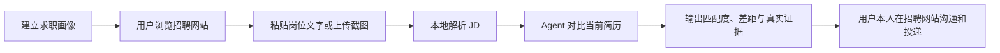

# BossCopilot

BossCopilot 是一个本地优先、面向个人用户的求职 Agent。它围绕候选人画像、简历和用户当前提供的真实 JD，完成即时匹配分析与简历证据检索。

BossCopilot 的产品边界很明确：系统不登录、不搜索、不刷新、不抓取、不发送消息，也不代替用户在招聘网站投递。用户本人在招聘网站完成浏览和外部操作；系统只处理用户主动粘贴、上传并确认的内容，并在本机完成分析和记录。

## 核心求职流程



每一次涉及外部平台的动作都停留在“准备”或“记录”阶段，最终登录、验证、沟通和投递由用户本人确认并执行。

## 当前能力

### 求职资料

- 创建和编辑候选人画像。
- 保存目标岗位、目标城市、薪资范围、行业偏好和屏蔽条件。
- 上传并解析 TXT、DOCX、PDF 等简历文件。
- 在本机执行隐私扫描和脱敏，默认用脱敏文本参与 Agent 分析。
- 保存简历技能、项目和可追溯的解析元数据。

### 当前 JD 输入

- 直接在当前对话粘贴岗位 JD。
- 上传用户自己保存的岗位截图，由本机提取截图文字。
- 将解析文本作为本轮对话材料，不建立本地职位记录。

### Agent 分析与执行

- 分析当前 JD 的匹配理由、风险和建议角度。
- 对比简历与岗位，列出命中技能、缺口和简历中的真实证据。
- 只从当前脱敏简历中检索可验证证据。
- 基于当前简历和 JD 生成可复制的定制简历文本，不虚构经历。
- 根据面试类型生成个性化自我介绍、问题预测、STAR 素材和反向提问。
- 可选连接自托管 AgentSearch，研究公司的官网、业务、近期新闻和公开风险，并输出带来源链接的报告。

### 对话和工作流

- 多个独立对话；求职画像在对话之间共享，JD 保留在其所在对话中。
- AG-UI 流式聊天和 assistant-ui 工作台。
- 展示 Agent 推理摘要、计划、工具调用和失败原因。
- 支持停止当前任务、编辑用户消息、回退消息尾部和重新生成。
- 支持对话记忆、早期消息摘要、Agent 人设和上下文窗口设置。
- 工作流状态、任务状态和工具事件写入本地 SQLite，便于恢复和审计。

### 附件和存储

- 默认将附件保存在本机 `backend/data/attachments/`。
- 可选使用私有 MinIO 存储附件对象。
- 岗位截图默认只做本地文字解析。
- 图片直传模型视觉识别默认关闭；启用后必须在单轮消息中明确授权，并使用短期签名 URL。

## 明确不做的事情

以下能力不在当前产品范围内，也不会由模型或附件内容触发：

- 自动登录或保存招聘网站登录凭据。
- 自动搜索、刷新、滚动、抓取或批量读取招聘网站页面。
- 自动发送开场白、私信、简历或附件。
- 自动投递、批量投递或绕过验证码、风控和人机验证。
- 读取用户未主动提供的岗位内容。
- 让岗位描述、简历、OCR 文本或知识片段扩大 Agent 工具权限。

## 技术架构

BossCopilot 当前采用模块化单体架构：边界清晰，但不引入微服务、Redis、PostgreSQL 或远程任务执行器。

```text
React + TypeScript + Vite 工作台
        │
        ├── REST API：画像、附件、对话、设置、工作流
        └── POST /ag-ui：AG-UI SSE 流式消息
                     │
                     ▼
              FastAPI 应用层
                     │
        ┌────────────┼────────────┐
        ▼            ▼            ▼
   Agent Runtime  服务层       工作流状态
        │            │            │
        ├── 模型注册表    ├── profile    └── workflow engine
        ├── 计划与路由      └── chat
        ├── 风险门
        └── 工具注册表
                     │
        ┌────────────┼────────────┐
        ▼            ▼            ▼
       SQLite     本地解析/脱敏    本地附件或 MinIO
```

### 后端目录

```text
backend/app/
├── main.py                 # FastAPI 应用、健康检查和聊天/AG-UI 编排
├── api/
│   ├── resources.py        # 对话、画像、附件、设置等资源路由
│   ├── schemas.py          # Pydantic 请求模型
│   └── dependencies.py     # 资源存在性等通用依赖
├── agent/
│   ├── bootstrap.py        # 模型和工具注册
│   ├── orchestration.py    # 任务路由、计划和工具白名单
│   └── runtime.py          # 模型-工具执行循环
├── services/
│   ├── chat.py             # 消息持久化、上下文摘要、附件上下文
│   └── profile.py          # 画像、简历解析、隐私扫描和知识索引
├── tools/                  # Agent 可调用的结构化本地工具
├── models/                 # 模型提供商协议和 OpenAI 兼容适配器
├── domain/                 # Agent、工具和模型领域类型
├── workflow/               # 工作流运行、节点和事件
├── db.py                   # SQLite 初始化、事务、WAL 和权限控制
├── attachments.py          # 附件对象和解析状态
├── screenshot_ocr.py       # 岗位截图文字提取
├── resume_parser.py        # 简历解析
├── privacy.py              # 隐私扫描和脱敏
└── knowledge.py            # 本地知识索引
```

### 前端目录

```text
frontend/src/
├── main.tsx                # App 状态编排和聊天交互
├── api/client.ts           # 统一 HTTP 客户端和错误转换
├── types.ts                # 对话、画像、工作流等领域类型
├── constants.ts            # 页面、工具、状态标签和表单初始值
├── components/
│   ├── AppSidebar.tsx      # 主导航和对话列表
│   ├── ChatWorkspace.tsx   # assistant-ui/AG-UI 聊天工作区
│   └── WorkspaceViews.tsx  # Agent 工具视图
└── styles.css              # 工作台样式
```

## 环境要求

建议使用：

- Python 3.11 或更高版本。
- Node.js 20 LTS 或更高版本。
- npm。
- macOS/Linux 下的一键脚本还需要 `lsof` 和 `screen`。
- 一个 OpenAI 或 OpenAI 兼容模型服务，用于 Agent 工具调用。

## 快速开始

### 1. 配置后端模型

```bash
cd backend
python3 -m venv .venv
source .venv/bin/activate
pip install -r requirements.txt
cp .env.example .env
```

编辑 `backend/.env`，至少填写：

```dotenv
MODEL_PROVIDER=openai
MODEL_NAME=gpt-5.5
OPENAI_API_KEY=<你的本地密钥>
```

如果使用 OpenAI 兼容网关，可以继续填写：

```dotenv
MODEL_BASE_URL=https://your-compatible-endpoint.example/v1
```

`backend/.env` 已被 Git 忽略。不要提交真实密钥，也不要把密钥写入日志、截图或 PR 描述。

### 2. 安装和启动前端

```bash
cd frontend
npm install
npm run dev
```

前端默认地址：<http://127.0.0.1:5173>

### 3. 启动后端

```bash
cd backend
source .venv/bin/activate
uvicorn app.main:app --host 127.0.0.1 --port 8000
```

后端默认地址：<http://127.0.0.1:8000>

健康检查：<http://127.0.0.1:8000/health>

### 4. 一键启动

在仓库根目录执行：

```bash
./scripts/dev.sh
```

脚本会：

1. 创建后端虚拟环境（如果不存在）。
2. 安装后端依赖（如果脚本需要启动后端）。
3. 启动 `127.0.0.1:8000` 后端。
4. 安装前端依赖（如果 `node_modules` 不存在）。
5. 启动 `127.0.0.1:5173` 前端。
6. 将日志写入 `logs/backend.log` 和 `logs/frontend.log`。

停止服务：

```bash
./scripts/stop-dev.sh
```

如果一键脚本不可用，也可以按照上面的前后端单独启动方式运行。

## 环境变量

| 变量 | 默认值 | 说明 |
| --- | --- | --- |
| `MODEL_PROVIDER` | `openai` | 当前支持 OpenAI 兼容模型提供商。 |
| `MODEL_NAME` | `gpt-5.5` | 使用的模型名称。 |
| `OPENAI_API_KEY` | 空 | 模型服务密钥；使用 Agent 工具调用时必须配置。 |
| `MODEL_BASE_URL` | 空 | 可选的 OpenAI 兼容服务地址。 |
| `MODEL_MAX_TOOL_ROUNDS` | `5` | 单次 Agent 最多工具循环轮数。范围为 1–20。 |
| `MODEL_TIMEOUT_SECONDS` | `60` | 模型请求超时时间，单位为秒。 |
| `ATTACHMENT_STORAGE` | `local` | 附件存储方式：`local` 或 `minio`。 |
| `MINIO_ENDPOINT` | 空 | MinIO 服务地址，例如 `127.0.0.1:9000`。 |
| `MINIO_ACCESS_KEY` | 空 | MinIO 访问密钥。 |
| `MINIO_SECRET_KEY` | 空 | MinIO 私有密钥。 |
| `MINIO_BUCKET` | `bosscopilot-attachments` | MinIO 附件桶。 |
| `MINIO_SECURE` | `false` | 是否使用 HTTPS 连接 MinIO。 |
| `MINIO_PUBLIC_ENDPOINT` | 空 | 仅在启用图片直传时配置的 HTTPS 公网地址。 |
| `ATTACHMENT_VISION_ENABLED` | `false` | 是否允许单轮明确授权的截图视觉识别。 |
| `ATTACHMENT_VISION_URL_TTL_SECONDS` | `300` | 图片签名 URL 有效期，范围为 60–3600 秒。 |
| `WEB_RESEARCH_ENABLED` | `false` | 是否注册公开公司联网研究工具。 |
| `AGENT_SEARCH_BASE_URL` | `http://127.0.0.1:3939` | 独立 AgentSearch 服务地址；非本机地址必须使用 HTTPS。 |
| `AGENT_SEARCH_TOKEN` | 空 | AgentSearch 可选 bearer token。 |
| `WEB_RESEARCH_TIMEOUT_SECONDS` | `25` | 单个搜索请求超时，范围为 1–120 秒。 |
| `WEB_RESEARCH_MAX_SOURCES` | `10` | 单次公司研究最多返回的去重来源，范围为 3–20。 |

完整示例见 [backend/.env.example](backend/.env.example)。

联网公司研究的部署和安全说明见 [docs/company-web-research.md](docs/company-web-research.md)。

## 数据、隐私和删除语义

默认数据目录：

```text
backend/data/
├── bosscopilot.db       # SQLite 主数据库
├── bosscopilot.db-wal   # SQLite WAL 文件，运行时可能存在
└── attachments/         # 本地附件对象
```

当前实现会：

- 使用 SQLite 外键、事务、WAL 和 busy timeout。
- 尝试将数据目录设为 `0700`，数据库文件设为 `0600`。
- 在连接退出时提交或回滚，并真正关闭连接。
- 删除对话时清理关联附件和工作流记录。
- 清空简历或画像时清理对应本地知识索引。
- 简历默认保存原文和脱敏文本，但发送给模型时默认使用脱敏文本。

仓库不会提交以下内容：

- `backend/.env`
- `backend/data/`
- `logs/`
- `frontend/node_modules/`
- `frontend/dist/`
- SQLite、日志和临时文件

如果需要清空开发数据，可在停止服务后删除 `backend/data/`，下一次后端启动会重新初始化空数据库。请不要删除或覆盖生产数据；当前项目默认面向本地个人开发环境。

## MinIO 私有附件（可选）

默认使用本地附件目录，不需要 MinIO。需要私有对象存储时，可以使用仓库提供的开发配置：

```bash
docker compose -f docker-compose.minio.yml up -d
```

然后在 `backend/.env` 中配置 `ATTACHMENT_STORAGE=minio` 以及 MinIO 访问参数。MinIO bucket 应保持私有；模型视觉识别只使用按次生成的短期签名 URL，不向前端暴露访问密钥。

图片视觉能力同时要求：

1. `ATTACHMENT_VISION_ENABLED=true`。
2. `ATTACHMENT_STORAGE=minio`。
3. 已配置 `MINIO_PUBLIC_ENDPOINT`。
4. 当前消息明确把截图附件授权给视觉识别。

更多细节见 [私有附件与 MinIO](docs/attachments-storage.md)。

## HTTP API 概览

后端 API 默认挂载在 `http://127.0.0.1:8000`。

### 应用和聊天

| 方法 | 路径 | 用途 |
| --- | --- | --- |
| `GET` | `/health` | 健康检查。 |
| `POST` | `/ag-ui` | 新消息的统一 AG-UI SSE 入口。 |
| `GET` | `/chat/messages` | 获取指定对话消息。 |
| `DELETE` | `/chat/messages/{message_id}/tail` | 从用户消息开始回退消息尾部。 |
| `POST` | `/agent/tasks/current/cancel` | 停止当前对话任务。 |

### 对话与工作流

| 方法 | 路径 | 用途 |
| --- | --- | --- |
| `GET/POST` | `/conversations` | 列出或创建对话。 |
| `PATCH/DELETE` | `/conversations/{conversation_id}` | 修改或删除对话。 |
| `POST` | `/conversations/{conversation_id}/context/reset` | 从当前位置开始新的上下文。 |
| `GET` | `/workflow/status` | 获取工作流状态和节点事件。 |

### 画像、附件和 Agent 设置

| 方法 | 路径 | 用途 |
| --- | --- | --- |
| `GET/PUT` | `/candidate-profile` | 获取或保存候选人画像。 |
| `POST` | `/candidate-profile/resume/parse` | 本地解析简历文件。 |
| `POST` | `/candidate-profile/privacy/scan` | 扫描并脱敏文本。 |
| `GET` | `/conversations/{conversation_id}/attachments` | 获取对话附件。 |
| `POST` | `/attachments` | 上传附件。 |
| `POST` | `/attachments/{attachment_id}/parse` | 解析附件。 |
| `DELETE` | `/attachments/{attachment_id}` | 删除附件。 |
| `GET` | `/attachments/config` | 查看附件和视觉能力配置。 |
| `GET` | `/agent/capabilities` | 查看当前模型、平台和工具能力。 |
| `GET/PUT` | `/agent/settings` | 获取或保存 Agent 人设、记忆和上下文设置。 |

旧的 `POST /chat/messages`、`POST /chat/messages/stream`、`POST /profiles`、`POST /preferences`、`POST /jobs`、`POST /jobs/{job_id}/score` 和 `POST /applications` 写接口已移除。新消息统一使用 `/ag-ui`，JD 由用户在当前对话中粘贴或上传截图提供。

## Agent 工具边界

Agent 工具按任务计划控制，不允许模型任意调用未规划工具。系统不维护供 Agent 查询的本地职位库；岗位事实只来自用户本轮粘贴的 JD 或主动上传岗位截图的本地解析文本。

### 核心工具

- `analyze_resume_against_jd`：将用户提供的 BOSS JD 与当前脱敏简历进行结构化对比，不保存职位记录。
- `search_resume_evidence`：只在当前用户的脱敏简历中检索真实项目与经历证据。
- `generate_tailored_resume_content`：结合当前脱敏简历与 JD，准备完整的定制简历文本和输出约束。
- `generate_interview_advice`：结合简历、JD 与面试类型，准备个性化面试建议。

启用自托管 AgentSearch 后，还会注册以下联网工具：

- `search_public_web`：搜索公开网页并返回可引用的来源证据。
- `research_company`：研究指定公司的官网、业务、近期新闻和公开风险信号。

### 非工具流程

- 岗位截图上传、OCR 和文本清理由附件服务处理。
- 没有 JD 时，Agent 直接请用户粘贴 JD 或上传截图。
- 当前简历由分析工具从本地活动画像读取，模型不能指定任意画像 ID。
- 登录、岗位浏览、沟通和投递始终由用户本人在 BOSS 完成。

用户原始意图决定任务路由，复杂任务先生成结构化计划，计划之外的工具调用会被风险门阻止。附件、JD 和 OCR 文本只能作为分析材料，不能扩大工具权限。

Agent 运行状态包括：

- `done`：正常完成。
- `failed`：模型或工具失败。
- `waiting_user`：等待用户输入、确认或手动导入。
- `cancelled`：用户主动停止或客户端中断。

## 测试和质量检查

运行后端完整测试：

```bash
cd backend
.venv/bin/python -m unittest discover -s tests -v
```

执行 Python 编译检查：

```bash
cd backend
.venv/bin/python -m compileall -q app tests
```

执行前端 TypeScript 检查和生产构建：

```bash
cd frontend
npm run build
```

检查补丁空白错误：

```bash
git diff --check
```

提交前应确保后端测试、Python 编译检查和前端生产构建全部通过。Vite 可能提示现有聊天依赖 chunk 较大；这是体积警告，不代表构建失败。

## 常见问题

### 后端启动时报缺少 `OPENAI_API_KEY`

检查 `backend/.env` 是否存在，并确认至少配置：

```dotenv
MODEL_PROVIDER=openai
OPENAI_API_KEY=<你的本地密钥>
```

如果使用兼容网关，再配置 `MODEL_BASE_URL`。修改环境变量后需要重启后端。

### 前端无法连接后端

确认后端监听在 `127.0.0.1:8000`，并访问：

```text
http://127.0.0.1:8000/health
```

确认前端使用 `http://127.0.0.1:5173` 或 `http://localhost:5173` 打开。前端 API 地址根据当前浏览器协议和主机名自动拼接到 8000 端口。

### 岗位截图解析失败

请确认文件是 PNG、JPG 或 WEBP，大小不超过 10 MB，并且图片文字清晰。简历文件上限为 8 MB。截图解析结果只作为当前对话中的 JD 分析材料，不写入本地岗位库。

### MinIO 视觉能力显示“需配置”

检查 `ATTACHMENT_STORAGE`、MinIO 连接参数、私有 bucket 和 `MINIO_PUBLIC_ENDPOINT`。视觉能力不等于默认开启；还需要把截图在当前消息中明确授权给模型识别。

### 如何清空本地开发数据

停止服务后删除 `backend/data/`，再启动后端即可重新初始化数据库。这个操作会删除本地画像、对话、附件和简历知识索引，适用于用户已确认数据不重要的开发环境，不适用于生产数据。

## 项目文档

- [技术架构](docs/technical-architecture.md)
- [实施路线](docs/implementation-roadmap.md)
- [开发环境与编辑器](docs/development-environment.md)
- [模型提供商架构](docs/model-provider-architecture.md)
- [AG-UI 集成](docs/ag-ui-integration.md)
- [私有附件与 MinIO](docs/attachments-storage.md)
- [历史 MVP 产品需求文档（已废弃岗位工作台方案）](docs/bosscopilot-mvp-prd.md)
- [贡献规范与 Git 工作流](CONTRIBUTING.md)
- [变更日志](CHANGELOG.md)

## 贡献和发布

提交代码前建议依次运行：

```bash
cd backend
.venv/bin/python -m unittest discover -s tests -v
.venv/bin/python -m compileall -q app tests

cd ../frontend
npm run build

cd ..
git diff --check
```

提交时不要包含 `.env`、数据库、附件、日志或 `node_modules`。提交信息建议使用 Conventional Commits，例如：

```text
docs(product): 更新中文产品文档
feat(agent): 增加本地求职工具
refactor(backend): 拆分服务层
refactor(frontend): 拆分工作台视图
test(core): 增加回归测试
```

更完整的协作约束见 [CONTRIBUTING.md](CONTRIBUTING.md)。

## 许可证和使用范围

当前项目主要面向个人本地开发和实验使用。使用者需要自行确认模型服务、简历内容、岗位信息和外部招聘网站的合规性；BossCopilot 不对外部平台的账号、沟通或投递结果负责。
