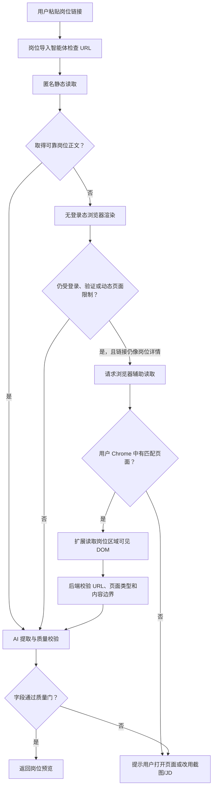

# BossCopilot 浏览器辅助岗位导入落地方案

> 日期：2026-07-30  
> 状态：待实施  
> 适用范围：本地单用户、个人研究、低频读取  
> 架构依赖：`docs/browser-agent-foundation-plan.md`

## 1. 方案结论

在通用浏览器能力基础层上实现第一个“岗位导入”业务适配器。当匿名静态读取和无登录态浏览器渲染因登录页、安全验证或动态内容失败时，由智能体判断是否值得请求浏览器辅助读取。

用户确认后，扩展只读取当前 Chrome 中已经渲染的岗位区域，将可见文本发送给本机 BossCopilot。后端重新验证页面与原链接是否一致，再由现有 AI 模型完成页面判断、字段提取和质量校验。

不直接复用 Codex/ChatGPT 内部的 Chrome 控制工具。BossCopilot 维护一个通用、最小权限的 Chrome 扩展；岗位模块只实现 BOSS 页面分类、岗位区块提取和导入质量门，不重复实现标签页管理、消息协议和风险策略。

推荐执行链路：



## 2. 目标与非目标

### 2.1 目标

- 读取用户当前 Chrome 中已经正常显示的单个岗位详情页。
- 复用现有 `JobImportAgent`、流式活动事件、字段提取和质量门。
- 由智能体根据实际观察选择公开读取、浏览器辅助或停止。
- 所有浏览器读取都由用户明确触发，并在界面展示执行状态。
- 不读取 Cookie、密码、LocalStorage、聊天记录、简历或浏览历史。
- 页面内容只在本机前端、Chrome 扩展和本机 FastAPI 之间流转。
- 对 BOSS 直聘先实现平台适配器，同时保留扩展其他招聘平台的接口。

### 2.2 非目标

- 不自动搜索、翻页、刷新或批量读取岗位。
- 不解决验证码，不绕过安全验证或访问控制。
- 不调用、逆向或模拟招聘平台私有接口。
- 不自动收藏、投递、沟通或上传简历。
- 不在后台持续扫描用户标签页。
- 不保证读取页面尚未渲染或用户本人不可见的内容。

## 3. 当前基础与缺口

当前项目已经具备：

- `JobImportAgent` 的模型—工具循环。
- `inspect_job_url`、`fetch_public_page`、`render_public_page`、`extract_job_fields`、完成和停止工具。
- `POST /job-imports/preview/stream` NDJSON 流式接口。
- 前端实时展示智能体判断、任务执行和最终记录。
- URL 安全校验、页面类型识别、Prompt Injection 隔离和岗位质量门。

当前缺口：

1. `render_public_page` 使用无登录态的临时浏览器，BOSS 页面可能跳转到安全验证页。
2. 后端无法读取用户当前 Chrome 已经显示的岗位 DOM。
3. 前端没有发现扩展、请求当前页面、接收页面内容的本地桥接。
4. 现有结果状态只有成功、部分、阻止和无效，缺少“等待浏览器读取”。
5. 当前文档仍将岗位链接能力描述为完全不使用用户浏览器，需要同步更新能力边界。

## 4. 总体架构

复用 `browser-agent-foundation-plan.md` 定义的 `browser-extension/`、Browser Command Broker、React bridge 和 Policy Gate，不让扩展直接调用模型，也不让扩展直接写数据库。

```text
Chrome 岗位标签页
  └─ job content script
       └─ 提取岗位区域可见文本
            ↓ chrome.runtime message
Chrome extension service worker
            ↓ chrome.runtime message
BossCopilot localhost bridge content script
            ↓ window.postMessage
React 前端
            ↓ POST /job-imports/browser-preview/stream
FastAPI
  └─ BrowserCaptureValidator
       └─ JobImportAgent
            ├─ 页面判断
            ├─ 字段提取
            └─ 质量校验
```

职责边界：

| 组件 | 职责 | 不允许做的事 |
| --- | --- | --- |
| BOSS content script | 读取当前岗位区域、清理文本、生成页面证据 | 读取 Cookie、点击页面、调用私有接口 |
| Extension service worker | 查找匹配标签页、转发一次请求和响应 | 后台扫描、批量导航、持久保存岗位内容 |
| localhost bridge | 连接 React 页面和扩展内部消息 | 接收非 BossCopilot 页面的调用 |
| React | 发现能力、请求用户操作、消费流式结果 | 信任或直接保存扩展返回的数据 |
| FastAPI | 校验来源、长度、URL 绑定并调用智能体 | 接收 Cookie、账号凭据和完整浏览器状态 |
| JobImportAgent | 决定下一步、提取字段、执行质量门 | 根据页面指令扩大权限或猜测缺失 JD |

## 5. 用户体验

### 5.1 正常公开页面

1. 用户粘贴链接并点击“读取岗位”。
2. 智能体公开读取成功。
3. 页面直接进入岗位预览，不调用扩展。

### 5.2 BOSS 风控页面

1. 智能体识别为 BOSS 岗位详情链接。
2. 静态读取和无登录态渲染均得到安全验证页。
3. 如果前端已发现扩展，返回 `browser_required`。
4. 页面显示：

   ```text
   需要从浏览器读取
   请先在 Chrome 中打开该岗位，然后读取当前页面。

   [读取浏览器中的岗位] [改为手动填写]
   ```

5. 用户点击后，扩展查找 canonical URL 相同的岗位标签页。
6. 找到后提取岗位区域，前端继续消费同一套智能体活动事件。
7. AI 校验通过后进入现有“确认识别结果”。

### 5.3 没有匹配标签页

显示：

```text
Chrome 中没有找到这个岗位页面

[在 Chrome 中打开] [重新检查] [粘贴 JD]
```

“在 Chrome 中打开”必须由用户点击触发，每次只打开一个标签页，不自动重试。

### 5.4 验证码或页面不可见

扩展检测到安全验证、验证码、岗位失效或正文为空时立即停止，不点击验证控件：

```text
当前浏览器仍显示安全验证，无法读取岗位内容。
```

## 6. 通用 Chrome 扩展中的岗位适配器

### 6.1 目录

```text
browser-extension/
  manifest.json
  package.json
  tsconfig.json
  vite.config.ts
  src/
    background.ts
    bridge.ts
    adapters/
      jobs/
        boss.ts
        generic-job.ts
    shared/
      messages.ts
      normalize.ts
      types.ts
  tests/
    boss-extractor.test.ts
    bridge.test.ts
    fixtures/
      boss-job-detail.html
      boss-security-page.html
```

### 6.2 Manifest V3 权限

基础扩展权限以 `browser-agent-foundation-plan.md` 为准。岗位适配器第一版只启用以下固定 host：

```json
{
  "host_permissions": [
    "http://127.0.0.1:5173/*",
    "http://localhost:5173/*",
    "https://www.zhipin.com/*"
  ]
}
```

通用扩展仍明确不申请：

- `cookies`
- `history`
- `webRequest`
- `downloads`
- `clipboardRead`
- `nativeMessaging`

开发和生产端口如果不同，构建时生成不同 manifest，不使用宽泛的 `http://*/*`。

### 6.3 页面提取策略

BOSS 适配器只提取岗位详情区域：

- 一级标题中的岗位名称。
- 标题附近的薪资、地点、经验和学历。
- “职位描述”标题所在区块。
- 公司名称和公开公司标签。
- 福利标签。
- 工作地址。

提取规则：

1. 优先使用经过 fixture 测试的稳定选择器。
2. 选择器失效时，使用“职位描述”“工作地址”等可见标题定位相邻区块。
3. 只返回 `innerText`，不返回原始 HTML、脚本、表单值或隐藏节点。
4. 删除导航栏、推荐岗位、个人用户名、消息入口、简历入口、招聘者联系方式等无关内容。
5. 合并空白和异常分隔符，保留列表换行。
6. 单页正文最大 50,000 字符；超过后只保留岗位区块并返回截断标记。

扩展返回结构：

```ts
type BrowserJobCapture = {
  schema_version: "browser-job-capture-v1";
  capture_id: string;
  requested_url: string;
  final_url: string;
  platform: "boss" | "generic";
  page_type:
    | "job_detail"
    | "login_required"
    | "captcha"
    | "job_expired"
    | "empty_page"
    | "unknown";
  title: string;
  visible_text: string;
  hints: {
    job_title: string;
    company_name: string;
    location: string;
    salary_text: string;
    description: string;
  };
  captured_at: string;
  truncated: boolean;
};
```

`hints` 只是适配器观察，后端不能直接信任，仍需独立校验和 AI 提取。

### 6.4 消息协议

页面与扩展使用固定消息类型：

```text
BOSSCOPILOT_EXTENSION_HELLO
BOSSCOPILOT_CAPTURE_REQUEST
BOSSCOPILOT_CAPTURE_PROGRESS
BOSSCOPILOT_CAPTURE_RESULT
BOSSCOPILOT_CAPTURE_ERROR
```

每次请求包含随机 `request_id`，响应必须匹配该 ID。bridge 必须验证：

- `event.source === window`
- 当前页面 origin 是 `http://127.0.0.1:5173` 或 `http://localhost:5173`
- 消息类型属于白名单
- 请求只包含 URL、request ID 和单次动作参数

service worker 每次只处理一个 capture；第二个请求返回 `capture_busy`。

### 6.5 标签页匹配

1. 对请求 URL 和标签页 URL 做 canonicalize：
   - hostname 小写；
   - 删除 fragment；
   - BOSS 岗位链接删除 `securityId` 等临时查询参数；
   - 保留 `/job_detail/{job-id}.html`。
2. 只接受 canonical URL 完全相同的标签页。
3. 多个匹配标签页时使用最近激活的一个。
4. 不匹配时不得读取其他 BOSS 岗位。

## 7. 后端设计

### 7.1 新增模型

在 `backend/app/api/schemas.py` 增加：

```python
class JobImportCapabilities(BaseModel):
    browser_capture: bool = False


class JobImportPreviewIn(BaseModel):
    url: str = Field(min_length=1, max_length=2_000)
    capabilities: JobImportCapabilities = Field(
        default_factory=JobImportCapabilities
    )


class BrowserJobCaptureIn(BaseModel):
    schema_version: Literal["browser-job-capture-v1"]
    capture_id: str = Field(min_length=16, max_length=100)
    requested_url: str = Field(min_length=1, max_length=2_000)
    final_url: str = Field(min_length=1, max_length=2_000)
    platform: Literal["boss", "generic"]
    page_type: Literal[
        "job_detail",
        "login_required",
        "captcha",
        "job_expired",
        "empty_page",
        "unknown",
    ]
    title: str = Field(default="", max_length=500)
    visible_text: str = Field(default="", max_length=50_000)
    hints: dict[str, str] = Field(default_factory=dict)
    captured_at: str = Field(max_length=50)
    truncated: bool = False
```

### 7.2 新增模块

创建 `backend/app/job_browser_capture.py`：

- canonical URL 对比。
- 域名与 HTTPS 校验。
- `captured_at` 新鲜度校验，默认不超过 5 分钟。
- 页面类型硬拦截。
- 文本长度和字段类型校验。
- 去除控制字符。
- 将捕获结果转换为 `PageArtifact(strategy="user_browser")`。
- 对页面文本标记为不可信证据。

### 7.3 新增流式接口

```text
POST /job-imports/browser-preview/stream
Content-Type: application/json
Response: application/x-ndjson
```

接口流程：

1. 校验 capture schema。
2. 校验 requested URL 和 final URL 指向同一岗位。
3. 发布“正在验证浏览器页面”事件。
4. 页面是验证码、登录、失效或空内容时直接返回停止结果。
5. 将 capture 转为 `PageArtifact`。
6. 复用 `extract_job_fields` 与 `finish_job_import`。
7. 返回现有 `JobImportPreview` 结构。

扩展不能直接调用这个接口；由 BossCopilot React 页面接收扩展消息后调用，以保持本地 API 的现有来源边界。

### 7.4 智能体状态与工具

`JobImportPreview.status` 增加：

```text
browser_required
```

`JobImportState` 增加：

```python
browser_capture_available: bool = False
browser_capture_requested: bool = False
```

公开读取阶段增加工具：

```text
request_browser_capture
```

仅在以下条件同时满足时开放：

- 链接校验通过；
- requested page type 是 `job_detail`；
- 前端声明扩展可用；
- 静态读取已经执行；
- 无登录态渲染已经执行；
- 当前证据为 `login_required`、`captcha`、`access_denied`、`empty_page` 或动态正文不足；
- 尚未请求浏览器读取。

该工具不控制 Chrome，只返回结构化等待状态：

```json
{
  "status": "browser_required",
  "reason": "公开读取受到页面限制，可从当前 Chrome 页面读取",
  "requested_url": "...",
  "platform": "boss"
}
```

浏览器 capture 到达后启动受限的第二段 Agent。它只开放：

```text
inspect_browser_capture
extract_job_fields
finish_job_import
stop_job_import
```

第二段不能再调用网络读取或请求另一个 URL。

## 8. 前端设计

### 8.1 新增模块

```text
frontend/src/features/job-import/
  browserBridge.ts
  browserCapture.ts
  types.ts
```

`browserBridge.ts` 负责：

- 在 500 毫秒内发现扩展。
- 发送一次 capture 请求。
- 以 `request_id` 关联响应。
- 15 秒超时。
- 组件卸载时移除监听器。
- 拒绝未知或重复响应。

### 8.2 状态机

```text
idle
→ public_reading
→ browser_required
→ browser_connecting
→ browser_reading
→ validating
→ ready | stopped | failed
```

状态必须来自真实事件，不使用虚假“思考步骤”。

### 8.3 页面展示

复用现有 `jobImportActivity`：

- `公开读取岗位页面`
- `检测到页面安全验证`
- `等待浏览器页面`
- `已读取当前岗位区域`
- `正在验证岗位字段`
- `岗位内容通过质量校验`

浏览器辅助入口只在 `browser_required` 状态显示，不放在普通导入表单中长期占据页面。

## 9. 安全、隐私与风控边界

### 9.1 数据最小化

- 不读取或传输 Cookie、密码、LocalStorage、SessionStorage。
- 不读取聊天列表、简历页面、用户名和个人推荐数据。
- 不传完整 HTML，只传岗位区块的可见文本。
- 原始 capture 默认不落库；只保存用户确认后的岗位字段。
- 日志只记录 capture ID、平台、字符数、结果和错误码，不记录正文。

### 9.2 内容安全

- 浏览器页面文本始终视为不可信数据。
- 页面中的“忽略规则”“调用工具”等文本不能改变 Agent 权限。
- URL 绑定由代码校验，不由模型判断。
- 最终必须具有可靠岗位标题和至少 40 字岗位描述。
- 对推荐职位、公司介绍和当前岗位正文做来源区分，避免串岗。

### 9.3 低频约束

- 必须由用户点击触发。
- 同一时间只允许一个 capture。
- 默认 10 秒冷却时间。
- 单次最多读取一个匹配标签页。
- 不自动重试安全验证页。
- 不自动滚动、点击、搜索或打开推荐岗位。

### 9.4 功能开关

后端增加：

```text
BROWSER_JOB_IMPORT_ENABLED=false
```

前端只有在后端开关和扩展能力都可用时展示入口。关闭后恢复当前公开读取和手动输入流程。

## 10. 错误码与用户提示

| 错误码 | 用户提示 | 是否可重试 |
| --- | --- | --- |
| `extension_unavailable` | 未检测到 BossCopilot 浏览器助手 | 安装或启用后重试 |
| `target_tab_not_found` | Chrome 中没有找到这个岗位页面 | 打开页面后重试 |
| `page_mismatch` | 浏览器页面与提交的岗位链接不一致 | 切换到正确页面 |
| `security_challenge` | 当前浏览器仍显示安全验证 | 用户完成后手动重试 |
| `job_expired` | 岗位已下架或链接失效 | 否 |
| `content_incomplete` | 页面没有完整岗位描述 | 改用截图或粘贴 JD |
| `capture_busy` | 正在读取另一个岗位 | 稍后重试 |
| `capture_timeout` | 浏览器读取超时 | 可重试一次 |
| `capture_too_large` | 页面内容超过处理上限 | 适配器收窄岗位区域 |
| `extension_version_unsupported` | 浏览器助手版本不兼容 | 更新扩展 |

## 11. 实施任务

### 任务 1：定义跨端契约

**文件**

- 新建 `browser-extension/src/shared/types.ts`
- 修改 `backend/app/api/schemas.py`
- 修改 `frontend/src/types.ts`
- 新建 `backend/tests/test_browser_job_capture.py`

**工作**

- [ ] 定义 `browser-job-capture-v1`。
- [ ] 为 `JobImportPreview` 增加 `browser_required`。
- [ ] 定义统一错误码。
- [ ] 先写 URL 不匹配、过期 capture、超长文本和验证码页面测试。

**完成标准**

- 三端字段名称和枚举一致。
- 非 HTTPS、跨岗位 URL 和超过 5 分钟的 capture 被拒绝。

### 任务 2：建立 Chrome 扩展骨架

**文件**

- 新建 `browser-extension/manifest.json`
- 新建 `browser-extension/package.json`
- 新建 `browser-extension/tsconfig.json`
- 新建 `browser-extension/vite.config.ts`
- 新建 `browser-extension/src/background.ts`
- 新建 `browser-extension/src/bridge.ts`

**工作**

- [ ] 实现扩展发现握手。
- [ ] 实现 request ID 和 15 秒超时。
- [ ] 实现 canonical URL 标签页匹配。
- [ ] 验证 manifest 不含 cookies、history、webRequest 权限。

**完成标准**

- BossCopilot 页面能显示“浏览器助手已连接”。
- 扩展只在用户点击后查询一次匹配标签页。

### 任务 3：实现 BOSS 页面适配器

**文件**

- 新建 `browser-extension/src/content/boss.ts`
- 新建 `browser-extension/src/content/generic.ts`
- 新建 `browser-extension/tests/fixtures/*.html`
- 新建 `browser-extension/tests/boss-extractor.test.ts`

**工作**

- [ ] 保存脱敏后的岗位详情和安全页 fixture。
- [ ] 提取标题、薪资、地点、经验、学历、公司、JD、福利和地址。
- [ ] 排除导航、推荐岗位、个人信息和聊天内容。
- [ ] 识别 security、captcha、登录和岗位失效页面。

**完成标准**

- 给定当前 BOSS 岗位 fixture，可稳定提取完整四条 JD。
- 安全页不会被误判为岗位详情。
- 推荐岗位文本不会混入当前 JD。

### 任务 4：实现后端 capture 校验

**文件**

- 新建 `backend/app/job_browser_capture.py`
- 修改 `backend/app/job_import_agent.py`
- 修改 `backend/app/api/resources.py`
- 修改 `backend/app/api/schemas.py`

**工作**

- [ ] 实现 capture 规范化与 canonical URL 绑定。
- [ ] 将合法 capture 转为 `PageArtifact(strategy="user_browser")`。
- [ ] 增加 `/job-imports/browser-preview/stream`。
- [ ] 复用现有字段提取、质量门和 NDJSON 事件。
- [ ] 不记录 capture 正文。

**完成标准**

- 合法 BOSS capture 返回 `ready`。
- 页面不匹配、验证码、空正文均返回明确停止结果。
- 模型不可更改目标 URL。

### 任务 5：让智能体选择浏览器能力

**文件**

- 修改 `backend/app/job_import_agent.py`
- 修改 `backend/app/job_page_ai.py`
- 修改 `backend/tests/test_job_import_agent.py`
- 修改 `backend/tests/test_job_page_ai.py`

**工作**

- [ ] 在初始请求中传递 `browser_capture_available`。
- [ ] 增加 `request_browser_capture` 工具。
- [ ] 仅在公开读取策略耗尽后开放该工具。
- [ ] 扩展不可用时保持当前停止行为。
- [ ] 浏览器 capture 阶段不开放网络读取工具。

**完成标准**

- 智能体不会一开始就跳过公开读取。
- 同一次导入最多请求一次浏览器 capture。
- 浏览器内容不足时诚实停止，不猜测 JD。

### 任务 6：接入前端状态机

**文件**

- 新建 `frontend/src/features/job-import/browserBridge.ts`
- 新建 `frontend/src/features/job-import/browserCapture.ts`
- 修改 `frontend/src/main.tsx`
- 修改 `frontend/src/components/WorkspaceViews.tsx`
- 修改 `frontend/src/styles.css`

**工作**

- [ ] 启动时发现扩展能力。
- [ ] preview 请求携带 capability。
- [ ] 处理 `browser_required`。
- [ ] 用户点击后请求 capture 并消费第二段 NDJSON。
- [ ] 合并两段活动事件，避免重复停止原因。
- [ ] 增加缺少扩展、标签页不匹配和验证页提示。

**完成标准**

- 从粘贴链接到确认岗位不需要用户复制 JD。
- 所有外部浏览器读取均有明确按钮和可见状态。
- 用户取消或超时后可以重新输入或手动填写。

### 任务 7：测试、文档与开关

**文件**

- 修改 `README.md`
- 修改 `docs/current-project-overview.md`
- 修改 `docs/technical-architecture.md`
- 修改 `docs/development-environment.md`
- 新建前后端集成测试

**工作**

- [ ] 增加扩展开发模式安装说明。
- [ ] 增加本地端口和 host permissions 说明。
- [ ] 增加功能开关。
- [ ] 增加手工验收清单。
- [ ] 运行完整后端、前端和扩展测试。

**建议命令**

```bash
cd backend
.venv/bin/python -m unittest discover -s tests

cd ../frontend
npm run build

cd ../browser-extension
npm test
npm run build
```

## 12. 测试矩阵

| 场景 | 预期 |
| --- | --- |
| 普通公开 JobPosting 页面 | 不调用扩展，直接导入 |
| BOSS 匿名读取进入 security.html，Chrome 正常显示 | 请求浏览器读取并导入 |
| Chrome 没有目标标签页 | `target_tab_not_found` |
| Chrome 打开另一个岗位 | `page_mismatch` |
| Chrome 仍是安全验证页 | `security_challenge` |
| 岗位已下架 | `job_expired` |
| 只有标题没有 JD | `content_incomplete` |
| 页面包含 Prompt Injection 文本 | 不改变工具权限 |
| 同时点击两次读取 | 第二次返回 `capture_busy` |
| 扩展不可用 | 保持公开读取与手动输入 |
| capture 超过 5 分钟 | 后端拒绝 |
| capture 超过 50,000 字 | 后端拒绝或适配器截断 |

## 13. 验收标准

功能验收：

- [ ] 当前示例 BOSS 岗位可以从已登录 Chrome 中完整提取。
- [ ] 岗位名称、公司、薪资、地点和 JD 与页面可见内容一致。
- [ ] 公开页面仍走现有快速路径。
- [ ] 扩展未安装时现有功能不受影响。
- [ ] 安全验证页不会显示成普通登录页。

安全验收：

- [ ] manifest 不包含 Cookie、历史、网络拦截和下载权限。
- [ ] 后端不接收任何账号凭据。
- [ ] 浏览器 capture 不落库、不进入普通日志。
- [ ] URL 不匹配时不能导入。
- [ ] 页面内容不能调用计划外工具。
- [ ] 不包含自动点击、验证码处理和批量导航代码。

工程验收：

- [ ] 后端完整测试通过。
- [ ] React 生产构建通过。
- [ ] 扩展单元测试和生产构建通过。
- [ ] 浏览器手工验证覆盖成功、无标签页、安全验证和串岗四种情况。
- [ ] 功能可以通过环境变量完全关闭。

## 14. 实施顺序与发布策略

建议按三个里程碑实施：

### M1：浏览器基础层与读取闭环

先完成 `browser-agent-foundation-plan.md` 的 Phase 0–1，再完成本方案 Task 1–4。扩展可以手动读取当前页面并调用独立 browser preview 接口，但尚不由智能体自动建议。

### M2：智能体编排与产品体验

完成 Task 5–6。智能体根据公开读取结果返回 `browser_required`，前端展示完整任务执行过程。

### M3：安全收口与文档

完成 Task 7、测试矩阵和全部验收项，再默认开启个人研究模式。

发布时默认保持：

```text
BROWSER_JOB_IMPORT_ENABLED=false
```

完成手工验收后由用户在本机 `.env` 中开启。发现平台页面结构变化、错误率升高或验证页频繁出现时，可以立即关闭扩展路径，不影响粘贴 JD、截图和公开链接导入。

## 15. 最终决策

本项目采用“用户触发、浏览器本地读取、后端 AI 校验”的辅助模式，不采用服务器爬虫强化、验证码处理或风控对抗方案。

第一版只支持从当前 Chrome 中读取单个 BOSS 岗位，成功后再抽象平台适配器。这样可以最大程度复用现有智能体和界面，同时把新增权限、维护成本和平台风险限制在可控范围内。
