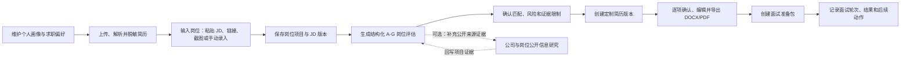
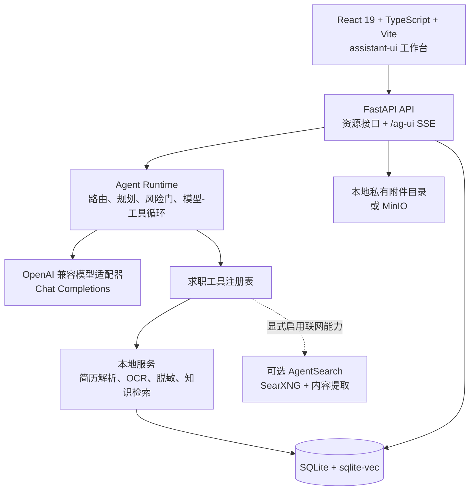

# BossCopilot 当前项目说明

> 本文基于 2026-07-29 的仓库代码、配置、测试和界面实现整理，用于回答“这是一个怎样的项目、当前有什么功能”。如历史 PRD、变更日志与本文冲突，应以当前代码、根目录 `README.md` 和 `docs/technical-architecture.md` 为准。

## 1. 一句话概括

BossCopilot 是一个面向个人用户的、本地优先的求职 Agent 工作台。

用户维护自己的求职画像和简历，通过粘贴 JD、输入公开岗位链接、上传岗位截图或手动录入建立岗位项目。系统先生成结构化 A–G 岗位评估，再在同一岗位项目下推进定制简历、PDF/DOCX 导出、面试准备和面试进程跟进。岗位来源、JD 版本和公开证据会保留在项目中，用于引用与审计，但不作为主导航。

它是一个可扩展的个人求职 Agent；公开信息研究和岗位来源能力是可选输入与证据能力，不应替代“评估 → 简历 → 面试”的主流程。

## 2. 当前工作区由什么组成

当前 `/Users/kkxny/BossCopilot` 是一个组合式工作区，不是单一 Git 仓库。

| 目录 | 角色 | 是否为 BossCopilot 运行必需 |
| --- | --- | --- |
| `bosscopilot/` | 主产品仓库，包含 React 前端、FastAPI 后端、测试和产品文档 | 是 |
| `agent-search/` | 独立的自托管搜索服务，可为公司研究和单轮联网搜索提供公开网页数据 | 否，联网能力启用时才需要 |
| `docs/`、`output/`、`tmp/` | Playwright 实践笔记、CSV、DOCX、截图和临时构建产物 | 否，不属于主产品运行链路 |
| `backend/` | 当前为空目录 | 否 |

因此，本文中的“项目”主要指 `bosscopilot/`；`agent-search/` 作为可选基础设施单独说明。

## 3. 产品目标和能力模型

### 3.1 要解决的问题

求职者面对一份具体 JD 时，通常需要重复完成以下工作：

- 判断岗位与自己是否匹配。
- 找出简历中能证明相关能力的真实经历。
- 针对岗位重写简历重点。
- 准备自我介绍、STAR 案例和面试问题。
- 调查目标公司的业务、动态和公开风险。

BossCopilot 把这些工作放进同一个本地工作台，并让画像、简历、对话和任务结果能够复用。

### 3.2 当前默认行为与扩展边界

主流程不依赖自动发现或浏览器抓取；岗位来源能力只服务于用户已经选定的岗位输入。系统不会默认执行以下动作：

- 招聘网站登录、Cookie 或账号凭据管理。
- 在没有用户明确触发的情况下自动搜索、刷新、滚动或批量抓取招聘页面。
- 自动联系 HR、发送消息或附件。
- 自动投递、批量投递或维护投递队列。
- 验证码处理、风控对抗和私有接口逆向。

用户主动触发的公开链接解析、浏览器当前页面读取、公司公开信息研究和岗位来源扫描仍可作为可选能力存在；这些结果必须回到岗位项目，不能绕过 A–G 评估直接生成后续材料。新的外部能力可以通过平台适配器或结构化工具接入。附件和网页内容不能动态扩大 Agent 权限，验证码与平台安全验证也不提供规避机制。

## 4. 用户可以怎样使用它



一个典型使用流程是：

1. 在“设置”中填写姓名、目标岗位、目标城市、薪资范围、技能、行业偏好和屏蔽条件。
2. 上传 PDF、DOCX、TXT 或 Markdown 简历，使用快速或增强模式解析。
3. 本机扫描邮箱、手机号和中国大陆身份证号，并生成脱敏版本。
4. 在“岗位项目”中粘贴 JD、输入岗位链接、上传岗位截图或手动填写岗位资料，并确认保存内容。
5. 生成结构化 A–G 岗位评估，查看匹配分、风险双轨、证据引用和未知项。
6. 确认评估后创建定制简历版本，接受、拒绝或编辑每项修改，并导出 DOCX/PDF。
7. 创建面试准备包，勾选准备清单，并记录每轮面试安排、结果和后续动作。
8. 用户自行前往招聘网站完成沟通或投递；公开信息研究只作为岗位项目的补充证据。

## 5. 已实现的功能

### 5.1 候选人画像与求职偏好

- 保存一份当前候选人画像。
- 保存目标岗位、目标城市、最低/最高期望薪资。
- 保存技能、偏好行业、屏蔽关键词和屏蔽公司。
- 从简历文本中提取技能并建议可填充的画像字段。
- 画像可跨对话复用。

当前产品面向本机单用户，不是多账号、多租户系统。

### 5.2 简历解析、隐私和本地知识检索

- 支持 PDF、DOCX、TXT、Markdown 简历，单文件上限 8 MB。
- 快速解析使用 `pypdf`、`python-docx` 或文本解码。
- 增强解析使用 Docling，适合更复杂的文档；不可用时可回退到快速解析。
- 本机识别并脱敏邮箱、手机号和中国大陆身份证号。
- 默认可用脱敏简历参与模型分析。
- 将脱敏简历分块后写入本地知识索引。
- 使用 256 维确定性哈希向量和 `sqlite-vec` 检索简历证据，不需要远程 Embedding 服务。
- `sqlite-vec` 不可用时回退到 SQLite 文本匹配。

简历证据工具只检索 `resume` 类型的知识片段，不会混入岗位或互联网内容。

### 5.3 岗位输入

- 支持用户明确提交公开 HTTPS 岗位链接，先生成预览，再由用户确认并保存为岗位项目。
- 链接解析不携带登录态、Cookie或账号凭据，只允许公开互联网地址和标准 HTTPS 端口。
- 页面要求登录、拒绝访问或使用无法直接读取的动态内容时，不尝试绕过；启用本地浏览器助手后，可以由用户明确触发并读取 Chrome 中已经显示的匹配岗位区域。
- 浏览器助手只返回可见岗位字段，不读取 Cookie、密码、浏览历史、聊天内容或简历页面。
- 优先读取页面中的 Schema.org `JobPosting` 结构化数据，缺失时回退到页面标题、元信息和可见岗位正文。
- 在工作台直接粘贴最多 50,000 字符的岗位 JD。
- 在对话中上传 PNG、JPG、JPEG 或 WebP 岗位截图，单文件上限 10 MB。
- 岗位截图默认在本机通过 Docling OCR 提取文字。
- 可选开启“模型看图”；只对当前一轮生效，并要求 MinIO、可公开访问的 HTTPS 地址和显式功能开关。
- 图片直传使用短期签名 URL；简历不支持图片直传。

工作台中的 JD 可以由用户明确保存为本地岗位项目，并关联独立对话。聊天中临时粘贴的 JD 和截图解析结果只作为当前对话材料使用，不会自动创建岗位项目。

岗位项目可在本机生成持久化的结构化 A–G 决策与证据报告：

- A：岗位概要与事实边界。
- B：匹配度、缺口和简历证据。
- C：职级与职业策略适配。
- D：薪资、地点、用工方式和需求核验。
- E：定制简历计划。
- F：面试准备计划。
- G：真实性、合规和用工风险。
- 为每项要求查找当前脱敏简历中的直接证据，并区分明确匹配、部分匹配和缺少证据。
- 检查目标城市、薪资下限、屏蔽公司和屏蔽关键词等偏好冲突。
- 给出保守的投递建议、下一步和分析限制；风险与匹配分保持分开。
- 用户可以逐项纠正判断；人工反馈不会覆盖系统原始结果。

只有有效且未过期的 A–G 报告才能进入后续材料流程；报告缺失、仍在运行或已过期时，前端会引导回评估页面。

岗位报告可以继续生成持久化的定制简历版本：

- 每个岗位可以保留多个版本，主简历不会被覆盖。
- 系统建议按求职目标、职业概述、核心能力和经历重排拆成独立修改项。
- 每项系统修改保留岗位信息或脱敏简历证据；用户手工编辑会被单独标记。
- 待确认和已接受的修改进入预览；拒绝后恢复该部分原文或移除新增内容。
- 版本可标记为草稿或最终版，并导出 DOCX、PDF。
- JD 或当前简历发生变化后，必须重新生成岗位分析才能创建新版本。

岗位项目还可以持久化面试准备和求职进度：

- 按综合、HR、业务、技术或终面生成不同准备包。
- 自我介绍、问题预测和回答方向只引用当前脱敏简历的可验证内容。
- STAR 素材保留原始证据，背景、任务、行动和结果由用户本人补全。
- 准备任务可逐项勾选，准备包可标记为草稿或已就绪。
- 面试轮次记录时间、联系人、地点、状态和结果。
- 创建面试轮次时，已保存或已投递岗位会自动进入“面试中”；Offer、未通过等终态不会被自动降级。
- 岗位创建、状态变化、准备包、面试安排、结果和手工备注统一进入时间线。

### 5.4 Agent 求职能力

当前运行时注册了六个结构化工具：

| 工具 | 用户能力 | 数据范围 |
| --- | --- | --- |
| `analyze_resume_against_jd` | 分析技能命中、能力缺口、证据、可信度和限制 | 当前 JD、当前脱敏简历 |
| `search_resume_evidence` | 查找能证明某项能力的项目和经历 | 本地脱敏简历 |
| `generate_tailored_resume_content` | 生成完整、可复制的岗位定制简历文本 | 当前 JD、当前脱敏简历 |
| `generate_interview_advice` | 生成自我介绍、问题预测、回答方向、STAR 素材、反向提问和准备清单 | 当前 JD、当前脱敏简历 |
| `research_company` | 核验公司身份，研究业务、动态、正面/风险信号并保留来源 | 公开互联网 |
| `search_public_web` | 为用户明确开启的单轮消息搜索公开网页 | 公开互联网 |

运行时会先根据用户原始消息把任务路由到普通咨询、JD 分析、画像分析、定制简历、面试准备、完整求职包、公司研究、岗位尽调或单轮联网搜索等任务类型。

复杂任务会先生成结构化计划。模型只能看到本次计划允许的最小工具集合；调用计划外工具会被风险门阻止。附件 OCR、简历片段等不可信内容不参与权限判定。

### 5.5 对话和执行体验

- 多个独立对话，支持新建、重命名、归档、恢复和删除。
- 使用 AG-UI 通过 SSE 流式返回生命周期、文本、推理摘要、工具和状态事件。
- 展示任务路由、执行计划、工具进度、结果和失败原因。
- 支持停止当前生成。
- 支持编辑用户消息、回退该轮之后的消息并重新生成。
- 支持复制回答、失败重试和继续追问。
- 支持对话上下文重置；历史消息保留，只移动后续上下文起点。
- 可配置 Agent 名称、人设、回答风格、自定义指令、记忆开关、摘要开关和上下文消息数量。
- 早期消息可生成摘要，以控制上下文长度。

普通聊天不必调用工具；只有识别为结构化求职任务时才开放相应工具。

### 5.6 工作台和数据看板

前端有四个主要页面：

| 页面 | 当前作用 |
| --- | --- |
| 岗位项目 | 输入并保存岗位，查看 A–G 决策报告，管理定制简历、PDF/DOCX、面试准备包、面试轮次和完整时间线 |
| 求职总览 | 查看岗位项目数量、评估状态、简历版本、面试准备和最近行动 |
| 对话 | 查看 Agent 结果、附件、来源和执行过程，继续交流 |
| 设置 | 管理候选人资料、简历、偏好、Agent、模型和隐私相关配置 |

岗位输入和公开信息研究仍保留兼容页面，但不属于主导航；它们的结果应回到岗位项目并服务于评估。

### 5.7 可选的公开信息研究

联网研究默认关闭。启用后，BossCopilot 通过 `AgentSearchClient` 调用旁边的 `agent-search/` 服务：

- 使用 `/search`、`/search/extract` 和 `/read` 搜索并提取公开网页。
- 过滤非公开、内网、回环和不安全来源 URL。
- 对公司来源进行去重、分级和证据打包。
- 区分官网/政府监管来源与普通第三方来源。
- 要求联网回答包含可点击来源；缺少引用时会触发修正或失败。
- 公司研究来源默认可在本地缓存 14 天。
- 单个来源失败时可以保留其他可用的部分结果。

`agent-search/` 本身是一个独立 FastAPI 项目，封装 SearXNG，并提供搜索、内容提取、去重、来源评分、Prompt Injection 清理、失败适配、可选浏览器渲染和可选 Tor 私密栈。BossCopilot 当前只消费其中与搜索和读取有关的 HTTP 接口。

## 6. 系统架构



当前是模块化单体架构，不使用微服务拆分、Redis、PostgreSQL 或远程任务队列。AgentSearch 虽然是独立进程，但它是可选的外部搜索依赖，不承载 BossCopilot 的核心业务状态。

### 6.1 前端

主要技术：

- React 19、TypeScript、Vite 6。
- `@assistant-ui/react` 管理聊天交互。
- `@ag-ui/client` 消费标准流式事件。
- `react-markdown`、GFM 和 Ant Design X Markdown 渲染回答。
- Lucide React 提供图标。

关键文件：

- `frontend/src/main.tsx`：全局页面状态、数据加载和交互编排。
- `frontend/src/components/ChatWorkspace.tsx`：聊天、附件、联网开关和消息操作。
- `frontend/src/components/WorkspaceViews.tsx`：工作台、看板和设置页面。
- `frontend/src/api/client.ts`：HTTP 客户端。

### 6.2 后端

主要技术：

- Python 3.11+、FastAPI、Pydantic。
- OpenAI Python SDK 作为 OpenAI 兼容模型客户端。
- AG-UI Protocol 负责流式协议。
- LangGraph 用于工作流状态读取、节点同步和最终状态投影。
- SQLite 保存业务状态，`sqlite-vec` 提供本地向量检索。
- Docling、pypdf、python-docx、Presidio 处理文档、OCR 和隐私。

关键模块：

- `backend/app/main.py`：应用入口、健康检查、消息读取、取消和 `/ag-ui`。
- `backend/app/api/resources.py`：对话、附件、画像、设置和工作流资源接口。
- `backend/app/agent/`：任务路由、计划和模型-工具循环。
- `backend/app/tools/`：六个结构化 Agent 工具。
- `backend/app/services/`：聊天和候选人画像服务。
- `backend/app/attachments.py`：附件验证、存储、解析和删除。
- `backend/app/knowledge.py`：简历知识分块、索引和检索。
- `backend/app/workflow/engine.py`：工作台状态投影。

### 6.3 数据持久化

SQLite 主要表包括：

- `profiles`：候选人画像和简历文本。
- `preferences`：目标岗位、城市、薪资和偏好。
- `jobs`：用户主动保存的岗位项目及状态、优先级和来源。
- `job_analyses`：岗位要求、简历证据、偏好冲突、投递建议和用户反馈。
- `resume_versions`：岗位定制简历版本、分析快照引用、草稿/最终版状态和当前预览。
- `resume_changes`：每项修改的前后内容、证据、人工决策和用户编辑标记。
- `interview_kits`、`interview_tasks`：面试准备内容和行动清单。
- `interview_rounds`：面试类型、时间、联系人、地点、状态和结果。
- `job_events`：岗位创建、状态变化、面试和手工进展时间线。
- `conversations`、`conversation_tasks`、`chat_messages`：对话、当前任务和权威消息。
- `attachments`：附件元数据、解析状态和文本。
- `knowledge_chunks`、`vec_knowledge`：本地简历知识索引。
- `agent_settings`：Agent 人设、模型和记忆设置。
- `workflow_runs`、`workflow_nodes`、`workflow_events`：工作流状态与审计事件。
- `company_research_cache`：公司研究来源缓存。

数据库启用外键、WAL 和 10 秒 busy timeout。默认数据库与附件目录位于 `backend/data/`，并尽量设置为仅当前用户可读写。

## 7. 模型和配置

当前核心只实现了 `MODEL_PROVIDER=openai`，但支持通过 `MODEL_BASE_URL` 连接兼容 OpenAI Chat Completions 协议的网关。

关键配置包括：

- `MODEL_NAME`、`OPENAI_API_KEY`、`MODEL_BASE_URL`。
- `MODEL_MAX_TOOL_ROUNDS`、`MODEL_TIMEOUT_SECONDS`。
- `ATTACHMENT_STORAGE=local|minio` 及 MinIO 连接信息。
- `ATTACHMENT_VISION_ENABLED` 和签名 URL 有效期。
- `WEB_RESEARCH_ENABLED`、`AGENT_SEARCH_BASE_URL` 和可选 Bearer Token。

后端和前端开发服务默认只监听 `127.0.0.1`。模型调用仍可能把用户授权的脱敏文本发送给所配置的模型提供商，因此“本地优先”不等于“完全离线”。

## 8. 当前成熟度

该项目已经形成可以运行和测试的本地 MVP：

- 前后端主链路已实现。
- 求职任务有明确的工具边界和风险门。
- 隐私、附件、对话、知识检索和联网研究均有自动化测试。
- 2026-07-30 本次检查中，后端 83 个单元/接口测试全部通过。
- 前端 TypeScript 与 Vite 生产构建通过。

它仍不是面向公网或多人环境的成熟产品，主要原因包括：

- 面向本机单用户，没有应用级登录认证和多租户隔离。
- SQLite schema 仍主要通过 `CREATE TABLE IF NOT EXISTS` 和兼容性 `ALTER TABLE` 演进，尚无正式迁移版本体系。
- 前端缺少组件和端到端自动化测试。
- 当前生产构建存在一个超过 500 kB 的 JavaScript chunk 警告，需要进一步代码分割。
- `frontend/src/main.tsx` 和部分后端入口仍承担较多编排职责。
- 数据备份、导出、恢复和“一键清除个人数据”能力尚未完整产品化。
- 真实模型、真实 OCR 文档和真实 AgentSearch 部署仍需要受控集成测试。

## 9. 如何启动和验证

### 一键启动

```bash
cd bosscopilot
./scripts/dev.sh
```

默认地址：

- 前端：`http://127.0.0.1:5173`
- 后端：`http://127.0.0.1:8000`
- 健康检查：`http://127.0.0.1:8000/health`

停止服务：

```bash
./scripts/stop-dev.sh
```

### 验证

```bash
cd bosscopilot/backend
.venv/bin/python -m unittest discover -s tests -v

cd ../frontend
npm run build

cd ..
git diff --check
```

启用公司研究前，需要单独启动 `agent-search/`，然后在 `backend/.env` 中配置 `WEB_RESEARCH_ENABLED=true` 和对应服务地址。

## 10. 阅读代码和文档的建议顺序

1. `README.md`：当前能力、扩展机制和启动方式。
2. `docs/current-project-overview.md`：面向产品与开发者的全局概览。
3. `docs/technical-architecture.md`：架构原则和模块职责。
4. `frontend/src/components/WorkspaceViews.tsx`：用户能看到的主要任务入口。
5. `backend/app/agent/orchestration.py`：任务如何路由、规划和限制工具。
6. `backend/app/tools/`：每项 Agent 能力的真实输入、输出和数据边界。
7. `backend/app/api/resources.py` 与 `backend/app/main.py`：HTTP 和 AG-UI 接口。
8. `backend/tests/`：当前行为最可靠的可执行说明。

`docs/bosscopilot-mvp-prd.md` 已标记为历史方案，其中岗位库、投递台、状态管理等内容不代表当前实现。`CHANGELOG.md` 也保留了多轮方向调整的记录，不应把其中所有历史功能都视为现有能力。
